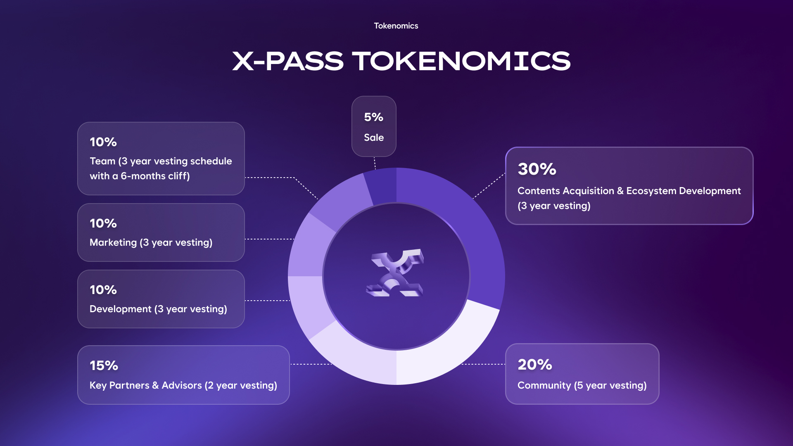

# XPassToken - KIP-7 Based ERC20 Token

A KIP-7 standard compliant ERC20 token contract running on the Kaia network.

## 🚀 Project Overview

XPassToken is a multi-functional token that can be used in the Kaia ecosystem, built on OpenZeppelin's verified contract library.

## 📋 Key Features

### **Basic KIP-7 Functions**
- ✅ **Token Transfer**: `transfer()`, `transferFrom()`
- ✅ **Permission Management**: `approve()`, `allowance()`
- ✅ **Balance Inquiry**: `balanceOf()`, `totalSupply()`
- ✅ **Metadata**: `name()`, `symbol()`, `decimals()`

### **Advanced Features**
- ⏸️ **Pause Function**: `pause()`, `unpause()` - Emergency response
- ✍️ **Signature-based Permission**: `permit()` - Gas cost savings
- 🎯 **Owner Management**: `Ownable` - Administrator function control

### **Multi-Signature Support**
- 🔐 **Multi-Sig Implementation**: Instead of implementing multi-sig code directly in the KIP7 contract, we utilize the [KAIA Safe](https://safe.kaia.io/) service to create multi-sig wallets and perform multi-signature operations using those wallets.
- 🔑 **Signature Requirements**: The multi-sig wallet is configured to require at least 2 out of 3 signer addresses to approve transactions, ensuring secure and decentralized decision-making.
- 🏗️ **Mainnet Deployment Strategy**: On mainnet, we will deploy directly to a multi-signature address created through KAIA Safe from the initial deployment, ensuring that the multi-sig wallet address becomes the owner from the deployment moment onwards.
- 🚀 **Constructor Parameter**: The contract constructor accepts an `initialOwner` parameter to set the initial owner address during deployment.

## 🏗️ Technology Stack

- **Solidity**: ^0.8.30
- **OpenZeppelin**: Latest version of verified contract library
- **Hardhat**: Development, testing, and deployment framework
- **Kaia Network**: Blockchain network

## 📦 Installation and Setup

### **1. Install Dependencies**
```bash
npm install
```

### **2. Environment Variables Setup**
Create a `.env` file based on the `env.example` template. Copy the example file and configure your environment variables:

```bash
cp env.example .env
```

Then edit the `.env` file and set the following required variables:

**Required Variables:**
- `PRIVATE_KEY`: Your private key for deployment 

**Network Configuration:**
- `KAIA_TESTNET_RPC_URL`: Kaia testnet RPC endpoint
- `KAIA_MAINNET_RPC_URL`: Kaia mainnet RPC endpoint

**Example .env file structure:**
```env
# Deployer Account
PRIVATE_KEY=your_private_key_here_without_0x

# Kaia Network RPC URLs
KAIA_TESTNET_RPC_URL=https://public-en-kairos.node.kaia.io
KAIA_MAINNET_RPC_URL=https://public-en.node.kaia.io
```

### **3. Compile Contracts**
```bash
npm run compile
```

## 🧪 Testing

### **Run Tests**
```bash
npm test
```

### **Test Coverage**
```bash
npx hardhat coverage
```

## 🚀 Deployment

### **Local Testnet**
```bash
# Start Hardhat node (new terminal)
npm run node

# Deploy locally (other terminal)
npm run deploy:localhost
```

### **Kaia Testnet**
```bash
npm run deploy:testnet
```

### **Kaia Mainnet**
```bash
npm run deploy:mainnet
```

## 📊 Contract Information

### **Token Details**
- **Name**: XPASS Token
- **Symbol**: XPASS
- **Decimals**: 18
- **Initial Supply**: 1,000,000,000 XPASS
- **Network**: Kaia (Chain ID: 1001 testnet, 8217 mainnet)

### **Deployed Addresses**
- **Testnet**: TBD (Deploy when ready)
- **Mainnet**: TBD (Deploy when ready)

## 📦 Token Allocation & Custody

A total of **1,000,000,000 XPASS** tokens are minted at deployment under a **single, non-upgradeable contract** and secured as follows:

- **Multi-Signature Safe Wallet**: Operated with external professional co-signers, requiring multiple approvals before any transaction can be executed.  
- **External Custody Provider**: Managed under institutional-grade custody and fully compliant with security standards.  

By adopting a single-deployment structure, the contract itself remains immutable.  
Variable parameters such as transaction fees or reward ratios are managed through **external contracts**.

---

## 📑 Token Policy

### Distribution Policy
- Allocation ratios (team, marketing, community, etc.) are transparently disclosed.  
- Vesting wallets are **purpose-labeled on KaiaScan** (e.g., “Team”, “Marketing”, “Community”), and wallet addresses are publicly published.  

### Governance
- The token does not grant governance rights over project operations.  
- Governance rights are limited to **DAO voting on cultural and content-related matters** (e.g., stage design, costumes, cast selection).  

### Utility
- Purchase of **1P1S NFT tickets**  
- Settlement for **NFT secondary trading**  
- Participation in **Ticket Stack** (staking and related rewards)  

## 🔧 Contract Structure

### **Inheritance Structure**
```
XPassToken
├── ERC20 (Basic token functions)
├── ERC20Pausable (Pause functionality)
├── Ownable (Owner management)
└── ERC20Permit (Signature-based permissions)
```

### **Key Functions**

#### **Constructor**
```solidity
constructor(address initialOwner)
```
- Set initial owner
- Mint initial supply


#### **Pause Management**
```solidity
function pause() public onlyOwner
function unpause() public onlyOwner
```
- Pause/resume token transfers
- Emergency response

#### **Internal Functions**
```solidity
function _update(address from, address to, uint256 amount)
    internal
    override(ERC20, ERC20Pausable)
```
- Check pause status before token transfer
- OpenZeppelin v5 compatible

## 🌐 Network Configuration

### **Hardhat Configuration**
```javascript
networks: {
  testnet: {
    url: "https://public-en-kairos.node.kaia.io",
    chainId: 1001,
    accounts: process.env.PRIVATE_KEY ? [process.env.PRIVATE_KEY] : []
  },
  mainnet: {
    url: "https://public-en.node.kaia.io",
    chainId: 8217,
    accounts: process.env.PRIVATE_KEY ? [process.env.PRIVATE_KEY] : []
  }
}
```

### **RPC Endpoints**
- **Testnet**: `https://public-en-kairos.node.kaia.io`
- **Mainnet**: `https://public-en.node.kaia.io`


## 📁 Project Structure

```
xpass-kip7/
├── contracts/
│   └── XPassToken.sol          # Main token contract
├── scripts/
│   └── deploy.js               # Deployment script
├── test/
│   └── XPassToken.test.js      # Test file
├── keygen/                     # Key generation tools
│   ├── generate-keys.js        # Key pair generation
│   ├── test-keys.js           # Key generation test
│   └── README.md              # Key generation tool description
├── hardhat.config.js           # Hardhat configuration
├── package.json                # Project dependencies
└── README.md                   # This file
```

## 🛡️ Security Features

### **Access Control**
- **Owner-only Functions**: `pause()`, `unpause()`
- **Pause Functionality**: Block token transfers in emergencies
- **OpenZeppelin Verified**: Industry standard security library


### **Gas Optimization**
- **Compiler Optimization**: 200 runs to minimize gas costs
- **Efficient Functions**: Prevent unnecessary gas consumption

## 📚 API Reference

### **ERC20 Standard Functions**
```solidity
// Read-only functions
function name() public view returns (string memory)
function symbol() public view returns (string memory)
function decimals() public view returns (uint8)
function totalSupply() public view returns (uint256)
function balanceOf(address account) public view returns (uint256)
function allowance(address owner, address spender) public view returns (uint256)

// State-changing functions
function transfer(address to, uint256 amount) public returns (bool)
function approve(address spender, uint256 amount) public returns (bool)
function transferFrom(address from, address to, uint256 amount) public returns (bool)
```

### **Extension Functions**
```solidity
// Pause functions
function pause() public onlyOwner
function unpause() public onlyOwner

// Signature-based permissions
function permit(address owner, address spender, uint256 value, uint256 deadline, uint8 v, bytes32 r, bytes32 s) public

// Utility functions
function version() public pure returns (string memory)
function maxSupply() public pure returns (uint256)
```

## 🐛 Troubleshooting

### **Common Issues**

#### **Compilation Errors**
```bash
# Reinstall dependencies
npm install

# Clear cache
npm run clean

# Recompile
npm run compile
```

#### **Deployment Failures**
```bash
# Check environment variables
echo $env:PRIVATE_KEY

# Test network connection
npx hardhat console --network testnet
```

#### **Insufficient Gas**
```bash
# Increase gas limit
npx hardhat run scripts/deploy.js --network testnet --gas-limit 10000000
```

## 🤝 Contributing

1. Fork this repository
2. Create a feature branch (`git checkout -b feature/AmazingFeature`)
3. Commit your changes (`git commit -m 'Add some AmazingFeature'`)
4. Push to the branch (`git push origin feature/AmazingFeature`)
5. Create a Pull Request

## 📄 License

This project is distributed under the MIT License. See the `LICENSE` file for details.

## 🙏 Acknowledgments

- [OpenZeppelin](https://openzeppelin.com/) - Verified smart contract library
- [Hardhat](https://hardhat.org/) - Development framework
- [Kaia Network](https://kaia.network/) - Blockchain network
